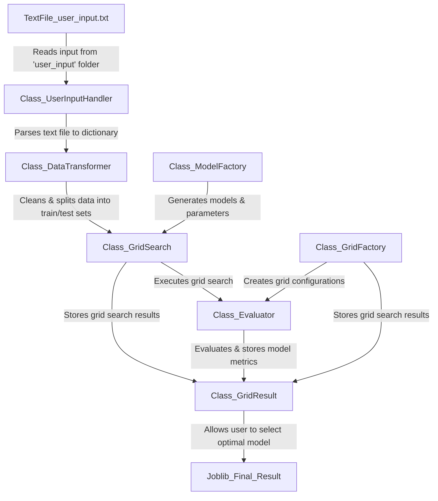

## Introduction

Welcome to FastML, a compact yet powerful machine learning framework created with the goal of streamlining the model selection process. It aims to offer a user-friendly, modular, and extensible solution for data scientists.

### The Thought Process and Learning Journey

When I embarked on the journey to create FastML, my initial goal was multifaceted. I aimed to tackle the complexities and challenges that accompany machine learning tasks, while also diving into the world of design patterns and principles. Building a functional framework thats robust, scalable and adheres to key design principles.

#### Exploring Design Patterns

The development of FastML became a hands-on learning experience for me. I took this opportunity to explore and implement various design patterns and principles like the Single Responsibility Principle and Dependency Inversion. Acting as a practical application of theoretical concepts that allowed me to understand their real-world implications better.

#### Leveraging Existing Libraries

In the spirit of simplicity and efficiency, I leveraged existing libraries to enhance FastML's capabilities. I utilized Skorch, a third-party library that acts as a wrapper for PyTorch models, making them compatible with the scikit-learn framework. This decision not only simplified the architecture but also allowed for cleaner, more focused classes.

Through FastML, I've been able to marry theory with practice, gaining invaluable insights into how well-designed software can adapt and evolve. While the project is currently modest in scale, its architecture is designed for future growth.

---
## Flowchart

### Strongly Addressed Principles:

- **Single Responsibility Principle (SRP)**: Each class and its methods have a single reason to change. For example, the `GridSearch` class is responsible for searching the parameter space, while its methods focus on specific aspects like parameter validation or search execution. Similarly, the `Evaluator` class and its methods are solely responsible for calculating metrics.

- **Open/Closed Principle**: Both the system and its individual methods are open for extension but closed for modification. You can add new types of evaluators or new ways of storing results without changing the existing code. Methods are designed to be overridden or extended where appropriate.

- **Loose Coupling**: The use of callbacks and dependency injection makes not only the classes but also their methods loosely coupled. This modular approach makes the system easier to test at both the class and method levels. For example, the `GridSearch` class is loosely coupled with the `Evaluator` class, by using a callback to pass the `Evaluator` class to the `GridSearch` 

- **High Cohesion**: Each class and its methods are focused on a specific set of tasks. For instance, each method in the `GridResult` class is highly cohesive, focusing on either storing results or determining the best model, making the system easier to understand and maintain.

- **Dependency Injection & Inversion**: The architecture is designed to minimize tight coupling between classes. Utilizing callbacks and runtime dependency injection, the system achieves a high degree of modularity. This design choice aligns well with the Dependency Inversion Principle, as it enables easier testing, maintenance, and future expansion.

- **Don't Repeat Yourself (DRY)**: By centralizing the logic for storing results and determining the best model in the `GridResult` class and its methods, you avoid repeating this logic in multiple places within the class or across the system.

### Additional Principles Addressed:
- **Liskov Substitution Principle**: The architecture employs an interface for the Evaluator class, facilitating the substitution of various evaluator types without disrupting the system's integrity. While this is a step in the right direction, additional opportunities for improvement exist. Specifically, classes like GridSearch and GridResult could also be abstracted into interfaces, thereby enhancing the system's flexibility and extensibility.

- **Interface Segregation Principle**:
In alignment with the Liskov Substitution Principle, the Evaluator interface has been designed to be modular and focused. This approach allows for the segregation of responsibilities into smaller, more specialized interfaces, should the need arise in future iterations of the project.

---

## Closing Thoughts

FastML is architected with a focus on scalability, modularity, and maintainability. The application adheres to several key design principles, providing a robust and flexible framework for various machine learning tasks. While the current implementation effectively addresses a broad range of use-cases, the architecture is intentionally designed to be extensible.

### Opportunities for Improvement:

1. **Abstraction**: Classes like `GridSearch` and `GridResult` could be further abstracted into interfaces, allowing for more diverse search strategies and result storage mechanisms.
  
2. **Interface Segregation**: As the project grows, there may be a need to break down the functionalities provided by classes like `GridSearch` into smaller, more focused interfaces, enhancing modularity.

3. **Dependency Injection**: While the use of callbacks has been effective in minimizing tight coupling, a more formalized dependency injection system could offer greater control and flexibility.

4. **Evaluator Flexibility**: The current use of an interface for the `Evaluator` class is a step in the right direction. Future versions could introduce more specialized evaluators, further enhancing the system's adaptability.
