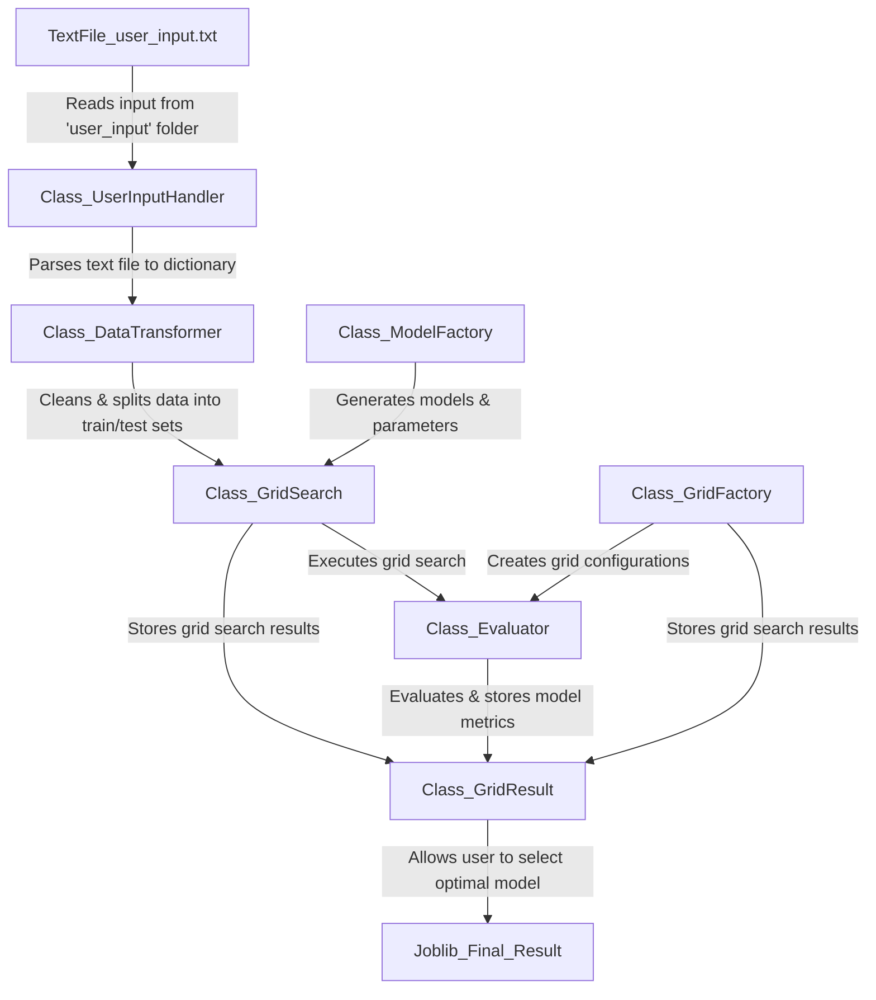

# FastML: Automated Machine Learning with SOLID Principles

---

#### Badges

[](https://opensource.org/licenses/MIT)
[](https://your-coverage-report-link)

---

## 📌 Introduction

FastML is an Object-Oriented Python library designed to automate the end-to-end process of machine learning projects. It cleans your data, performs grid search on multiple models based on your data type (regression or classification), and lets you pick the best model for the data. Developed with a strong focus on design patterns and SOLID principles, FastML aims to provide a robust, maintainable, and efficient way to handle ML projects.

---

## 🎯 Features

- **Data Cleaning** 🧹: Automated data preprocessing.
- **Regression and Classification** 📊: Supports both types of problems.
- **Grid Search** 🔍: Hyperparameter tuning for multiple models.
- **Model Selection** 🏆: Allows the user to select the best model based on evaluation metrics.
- **High Test Coverage** 🛡️: 98% test coverage using Pytest.
- **SOLID Principles** 🏗️: Strong adherence to SOLID principles and design patterns.
---

## 🛠️ Technologies Used

- Python
- Scikit-Learn
- PyTorch
- Pandas
- Skorch
- Pytest

---

## ⚙️ Installation

Shell
```bash
# Clone the repository
git clone https://github.com/v1kstrand/FastML

# Navigate to the project directory
cd FastML

# Install dependencies
pip install -r requirements.txt
```

Notebook
```bash
# Clone the repositor
!git clone https://github.com/v1kstrand/FastML

# Navigate to the project directory
import os
path = os.path.join(os.getcwd(), "FastML")
os.chdir(path)

# Install dependencies
!pip install -r requirements.txt
```

---

## 🚀 Usage

#### Step 1: Configure User Input

Navigate to the `user_input` folder and open `user_input.txt` located there. Fill in the required fields to configure the machine learning task. Save the file.

#### Step 2: Run the Program

Execute the `FastML.py` module to start the FastML program. This will read the configuration from the input file and execute the machine learning tasks accordingly.

```bash
Shell
python FastML

Notebook
%run FastML
```

#### Step 3: Retrieve the Best Model

After execution, the selected model will be saved in `models` folder as a .joblib file.

---

## ⚡ Quickstart

Upon successful installation, FastML is pre-packaged with example input files — input_titanic.txt for classification tasks and input_diabetes.txt for regression tasks. Corresponding .csv files are located in the CSV folder.

To experience the functionality and features of FastML, simply execute the FastML.py script. This will automatically engage the program with the provided test files, offering you an, hands-on introduction to its capabilities.

---

## 🌐 Flowchart



---

## 📜 License

This project is licensed under the MIT License. See the [LICENSE.md](LICENSE.md) file for details.

---

## 📧 Contact

- Email: [David.Vikstrand@gmail.com](mailto:David.Vikstrand@gmail.com)
